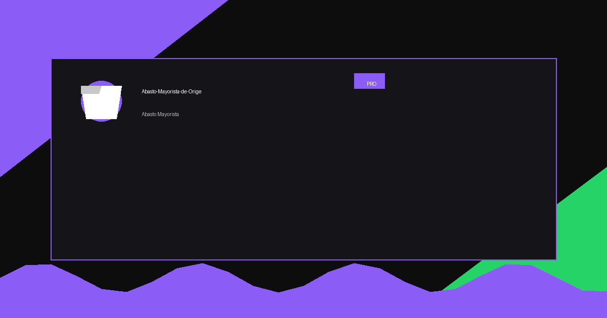

# Abasto Mayorista de Origen
<p align="center">
  
</p>


## Descripción del Proyecto

Sitio web multi-página para empresa agroindustrial especializada en suministro masivo de productos agrícolas de alta demanda: Chile Guajillo Seco, Ajo Fresco Calibrado y Jamaica Nigeriana. El sitio está diseñado para conectar directamente con clientes empresariales (procesadoras, distribuidoras, embotelladoras, industria alimentaria) que requieren volúmenes significativos con calidad estandarizada y precio fijo garantizado.

## 🌐 URL del Proyecto

**GitHub Pages (Producción):** https://oscaromargp.github.io/Abasto-Mayorista-de-Origen/

**Repositorio GitHub:** https://github.com/oscaromargp/Abasto-Mayorista-de-Origen

## 📋 Estructura del Proyecto

```
Abasto-Mayorista-de-Origen/
├── index.html                    # Página principal (landing page)
├── jamaica.html                 # Página del producto: Jamaica Nigeriana
├── ajo.html                     # Página del producto: Ajo Fresco Calibrado
├── chile-guajillo.html          # Página del producto: Chile Guajillo Seco
├── contacto.html                 # Página de contacto con opciones directas
├── politica-de-privacidad.html  # Política de privacidad (legal)
├── terminos-y-condiciones.html  # Términos y condiciones (legal)
├── aviso-legal.html             # Aviso legal (legal)
├── styles.css                   # Estilos CSS personalizados
├── script.js                    # Scripts JavaScript adicionales
├── images/                       # Carpeta de imágenes del proyecto
│   ├── wave_divider.svg
│   ├── leaf_decor_1.svg
│   └── leaf_decor_2.svg
├── n8n-workflow-*.json          # Workflows de n8n (documentación)
├── .github/
│   └── workflows/
│       └── deploy.yml           # Pipeline CI/CD para GitHub Pages
├── LICENSE                      # Licencia del proyecto
└── README.md                    # Documentación principal
```

## 🎨 Diseño y Tecnologías

### Tecnologías Utilizadas

| Tecnología | Propósito |
|------------|-----------|
| HTML5 | Estructura semántica del sitio |
| Tailwind CSS (vía CDN) | Framework de estilos y componentes |
| Alpine.js | Interactividad sin dependencias pesadas |
| Google Fonts (Inter) | Tipografía del proyecto |
| GitHub Pages | Hosting y distribución automática |

### Paleta de Colores

| Color | Hex | Uso |
|-------|-----|-----|
| Verde Agrícola | `#166534` | Color principal, CTAs, header |
| Verde Oscuro | `#124429` | Estados hover, acentos |
| Rojo Oscuro | `#9B1C1C` | Énfasis, botones principales |
| Rojo Más Oscuro | `#7A1515` | Estados hover en botones rojos |
| Gris Oscuro | `#1F2937` | Textos principales |
| Gris Claro | `#6B7280` | Textos secundarios |

### Diseño Visual

- **Estilo:** Premium industrial agrícola -干净, profesional, orientado a negocios
- **Tipografía:** Inter (Google Fonts) - Moderna, legible, profesional
- **Enfoque:** Mobile-first, totalmente responsive
- **Navegación:** Header sticky con menú desplegable en desktop, menú hamburguesa en móvil
- **Accesibilidad:** Semántica HTML correcta, contraste apropiado, navegación por teclado

## 🔧 Funcionalidades del Sitio

### 1. Página Principal (index.html)

La landing page principal incluye:

- **Hero Section:** Imagen de fondo con overlay, headline principal, subtítulo, botones de llamada a la acción (CTAs)
- **Quick Stats:** Estadísticas clave del negocio (productos, intermediarios, formalidad, tiempo de entrega)
- **Sección Quiénes Somos:** Descripción de la empresa, diferenciadores, garantía "Riesgo Cero"
- **Proceso (Cómo lo hacemos):** 4 pasos claramente explicados
- **Sección Productos:** Tarjetas de productos con imagen, descripción, características y CTAs
- **Testimonios:** 3 testimonios de clientes (con puesto, empresa y ubicación)
- **FAQs:** 8 preguntas frecuentes con acordeón interactivo
- **CTA Final:** Llamada a la acción antes del footer

### 2. Páginas de Producto (jamaica.html, ajo.html, chile-guajillo.html)

Cada página de producto sigue una estructura específica:

- **Hero específico del producto:** Imagen relacionada, título, descripción breve
- **Qué es y por qué es diferente:** Explicación del producto y diferenciadores
- **Proceso paso a paso:** 4-5 pasos del proceso de obtención
- **Formatos y volúmenes:** Detalle de presentaciones disponibles
- **Testimonios específicos:** 2-3 testimonios relacionados con el producto
- **FAQs detalladas:** 10 preguntas frecuentes específicas del producto
- **CTA Final:** Botón para contactar con referencia al producto

### 3. Página de Contacto (contacto.html)

La página de contacto prioriza el contacto directo:

- **Botón de llamada telefónica:** Teléfono +52 612 107 7805 con link `tel:`
- **Botón de WhatsApp:** Link directo con mensaje predefinido
- **Enlace a Google Forms:** Formulario alternativo para solicitud de cotización
- **Horario de atención:** Información clara de disponibilidad
- **Email:** Para documentación y facturas
- **Botón flotante de WhatsApp:** Accesible desde cualquier página del sitio

### 4. Header Sticky (todas las páginas)

- Logo con nombre de la empresa
- Navegación con menú desplegable de productos
- Botón de WhatsApp en desktop
- Menú hamburguesa para móvil
- Estado activo para la página actual

### 5. Footer (todas las páginas)

- Logo y descripción breve
- Links a productos
- Links a empresa (Quiénes Somos, Contacto)
- Información de contacto
- Links legales (Privacidad, Términos, Aviso)
- Copyright y créditos del desarrollador

## 📞 Productos Ofrecidos

| Producto | Descripción | Origen | Formato Mínimo |
|----------|-------------|--------|----------------|
| Jamaica Nigeriana | Flor entera de Hibiscus sabdariffa, alto rendimiento de pigmentación (35% más que otras), acidez natural ideal para embotellado industrial | Nigeria | 1 tarima (800 kg) |
| Ajo Fresco Calibrado | Bulbos de Allium sativum compactos, piel firme, clasificación Super/Extra/Primera, 6 meses de vida útil | Nacional/Importación | 1 tarima (800 kg) |
| Chile Guajillo Seco | Capsicum annuum con coloración roja intensa, textura flexible sin aceites, índice de rotura <5% | Nacional | 1 tarima (800 kg) |

## 🚀 Deployment y CI/CD

### Proceso de Despliegue

El sitio se deploya automáticamente mediante GitHub Actions:

1. **Trigger:** Cualquier push a la rama `main`
2. **Workflow:** Ejecuta `.github/workflows/deploy.yml`
3. **Proceso:** Compila y despliega a GitHub Pages
4. **Tiempo estimado:** 2-3 minutos

### Actualizar el Sitio

```bash
# Clonar el repositorio (si no lo tienes)
git clone https://github.com/oscaromargp/Abasto-Mayorista-de-Origen.git

# Navegar al directorio
cd Abasto-Mayorista-de-Origen

# Hacer cambios en los archivos necesarios

# Agregar cambios al staging
git add .

# Crear commit con descripción
git commit -m "feat: descripción del cambio realizado"

# Subir cambios a GitHub
git push origin main
```

El sitio se actualizará automáticamente en la URL de GitHub Pages.

## 📝 Formulario de Contacto

### Opción 1: Contacto Directo (Recomendado)

La forma más rápida de obtener una cotización es contactando directamente:

- **Teléfono:** +52 612 107 7805 (Lun-Vie 9am-6pm)
- **WhatsApp:** https://wa.me/526121077805 (respuesta inmediata)

### Opción 2: Google Forms

Formulario alternativo disponible en:
https://docs.google.com/forms/d/e/1FAIpQLSd6ybd-2iFuapt27ozfJVWQNQRuhs0rG6UmhH-SxDmflCz-Jg/viewform

### Opción 3: Email

Para documentación y facturas:
- oscaromargp@gmail.com

## 🔄 Mantenimiento y Mejoras

### Tareas Regulares

- Actualizar precios en páginas de productos
- Revisar y actualizar testimonios
- Verificar que todos los enlaces funcionen
- Actualizar documentación según cambios
- Revisar compatibilidad con navegadores

### Posibles Mejuras Futuras

- Integración con sistema de CRM
- Chat en vivo con Watson o similar
- Sección de blog/noticias
- Calculador de volumen online
- Portal de clientes con seguimiento de pedidos

## 📄 Aspectos Legales

El sitio incluye las siguientes páginas legales:

- **Política de Privacidad:** Cumplimiento con Ley Federal de Protección de Datos Personales
- **Términos y Condiciones:** Condiciones de venta y servicio
- **Aviso Legal:** Información legal de la empresa

## 📊 Métricas del Proyecto

| Métrica | Valor |
|---------|-------|
| Páginas | 7 páginas HTML |
| Imágenes | 3+ imágenes optimizadas |
| Temas de color | 2 principales (verde/rojo) |
| Workflows CI/CD | 1 configurado |
| Páginas legales | 3 completas |

## 👨‍💻 Información del Desarrollador

**Desarrollador:** OSCAR OMAR Gómez Peña
**Título:** Emprendedor Tecnológico Digital
**Technologías usadas:** GitHub, n8n, opencode, Tailwind CSS

## 📅 Historial de Cambios

| Fecha | Versión | Cambios |
|-------|---------|---------|
| 2026-03-19 | 1.0.0 | Actualización de página de contacto con opciones de contacto directo (teléfono, WhatsApp, Google Forms) |
| 2025 | 0.x.x | Versiones anteriores del sitio |

## 📄 Licencia

© 2026 Abasto Mayorista de Origen. Todos los derechos reservados.

---

**Nota:** Este proyecto fue desarrollado y documentado siguiendo las mejores prácticas de desarrollo web y las instrucciones de documentación para proyectos GitHub.

*Para soporte técnico o consultas sobre el sitio, contactar al desarrollador.*

## 💖 Apoya este Proyecto

Si este proyecto te fue útil, considera apoyarlo.

> **Dirección XRP**: `rBthUCndKy3Xbb19Ln4xkZeMwusX9NrYfj`


## 📬 Contacto

<p align="center">
  <strong>Oscar Omar Gómez Peña</strong>
</p>

<p align="center">
  <a href="https://oscaromargp.github.io/Oscaromargp/">
    
  </a>
  <a href="https://github.com/oscaromargp">
    
  </a>
  <a href="https://wa.me/526121077805">
    
  </a>
</p>


## 🙏 Agradecimientos

<p align="center">
  <br/>
  <em>
    "Porque Dios es el que en vosotros produce<br/>
    así el querer como el hacer,<br/>
    por su buena voluntad."
  </em>
  <br/>
  <strong>— Filipenses 2:13</strong>
  <br/><br/>
  Todo lo que aquí existe nació primero como un deseo en el corazón.<br/>
  Cada proyecto, cada línea, cada idea que toma forma —<br/>
  es un regalo de Aquel que nos dio tanto el sueño como la fuerza de alcanzarlo.<br/>
  <strong>A Dios, toda la gloria.</strong>
  <br/>
</p>


## 📸 Capturas de pantalla

<p align="center">
  
</p>

> ¿No puedes ver la imagen? [Ver en el navegador](assets/)

